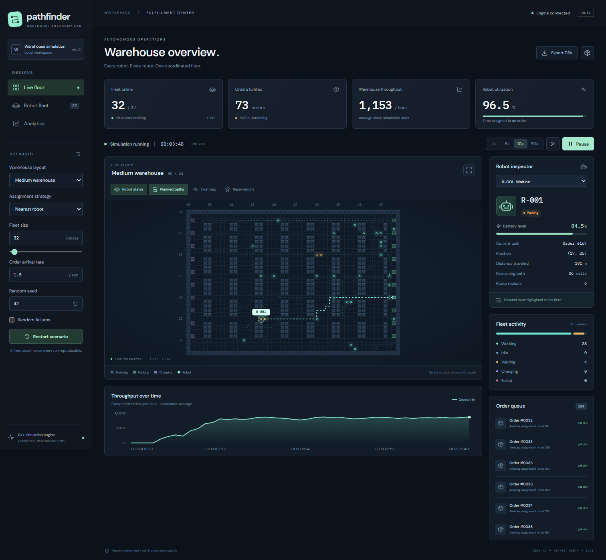
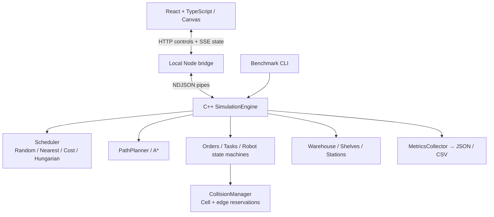

# Autonomous Multi-Robot Warehouse Simulator

**Pathfinder** is a C++20 warehouse autonomy lab with a live React dashboard. Robots receive orders, route around shelves and one another, deliver to packing stations, recharge, and recover from failures. Swap scheduling algorithms and measure how traffic changes throughput.

**Implemented:** hand-written A*, cell/edge reservations, four assignment policies including Hungarian, battery-aware task admission, failure recovery, deterministic simulation ticks, and JSON/CSV benchmarking. The engine is exercised at **500 robots in automated tests** and **1000 robots in measured experiments**. A separate run completed **10000 orders**, including recharge cycles.

## Demo



Build and run the project, then open **http://127.0.0.1:8080**. Try 10× speed, enable planned paths, and select a robot to inspect its current task and battery. Use the same layout and seed when comparing schedulers.

The dashboard includes live throughput and fleet metrics, a selectable warehouse canvas, heatmap/path/reservation overlays, a robot inspector, a task queue, metric exports, and controls for pause, step, restart, fleet size, arrival rate, scheduler and seed.

Demo media lives in [`docs/demo/`](docs/demo/README.md). That page explains how to reproduce the screenshot and where to add a GIF or video; no generated illustration is presented as a running simulation.

## Features

- **Deterministic C++ engine:** explicit tick ordering, separate random streams, configurable topology, value-owned domain models.
- **Hand-written A*:** binary priority queue, admissible Manhattan heuristic, route cost/node/timing statistics.
- **Concurrent collision avoidance:** exclusive cells, reverse-edge rejection, safe following chains, waiting, replanning and four-tick reservation forecasts.
- **Interchangeable assignment:** seeded random, Manhattan nearest, exact route-cost selection with A* confirmation, and rectangular Hungarian optimization.
- **Congestion-aware routes:** decaying density penalties and a cumulative traffic heatmap.
- **Battery management:** round-trip energy checks, charger admission, charging time and automatic return-to-work.
- **Failure recovery:** temporary/permanent failures, abandoned-order reassignment and physical failed-robot obstacles.
- **Real engine visualization:** React/TypeScript canvas, SSE snapshots and a small Node bridge to the C++ process.
- **Experiments and engineering:** offline CMake dependencies, Catch2 tests, Debug/Release presets, CI with Linux sanitizers, and measured benchmark artifacts.

## Getting started

### Prerequisites

- A C++20 compiler: GCC 12+, Clang 15+, or Visual Studio 2022 C++ tools.
- CMake **3.21+** and Ninja for the supplied presets.
- Node.js **20+** and npm for the dashboard, API and benchmark scripts.

The C++ dependencies are vendored; building the engine does not need a package download. Frontend/test dependencies are pinned by lockfiles and installed with `npm ci`.

### Clone, build, test, run

```sh
git clone https://github.com/ericqiumain-blip/Path-Finding-Robot-Simulator.git warehouse-simulator
cd warehouse-simulator

npm ci
npm --prefix frontend ci

npm run build
npm test
npm run test:api
npm start
```

Open **http://127.0.0.1:8080**. `npm start` serves the built dashboard and starts the real C++ engine. Stop it with Ctrl+C.

`npm run build:engine` creates `build/release/warehouse_sim` (`.exe` on Windows). `npm test` configures, compiles and tests Debug. Build helpers automatically detect the optional local `.tools/w64devkit/bin` compiler used in this workspace; that toolchain is not part of the repository. Other users should put their own compiler, CMake and Ninja on `PATH`. With MSVC, run preset commands inside a Developer PowerShell.

### C++ only

```sh
cmake --preset release
cmake --build --preset release --parallel
ctest --preset release

./build/release/warehouse_sim --robots 100 --orders 10000 --scheduler nearest --seed 42 --ticks 3600
```

On Windows, use `./build/release/warehouse_sim.exe`. To use a system's default CMake generator instead of Ninja:

```sh
cmake -S . -B build -DCMAKE_BUILD_TYPE=Release
cmake --build build --config Release --parallel
ctest --test-dir build -C Release --output-on-failure
```

Visual Studio's default generator puts executables in `build/Release/`; the Node bridge recognizes this location.

### Frontend development

Use two terminals:

```sh
# Terminal 1: native engine and API
npm run build:engine
npm start

# Terminal 2: React with hot reload
npm run dev:frontend
```

Open **http://127.0.0.1:5173**. Vite proxies `/api` to the C++ bridge at port 8080. The frontend displays a disconnected state if the engine is unavailable; it has no synthetic simulation fallback.

### Benchmarks and exports

```sh
# All four schedulers, seven fleet sizes, same layout/seed/workload
npm run benchmark

# Individual run; stdout is JSON
./build/release/warehouse_sim --robots 100 --orders 10000 --scheduler hungarian --seed 42 --layout large --ticks 3600 --json run.json --csv run.csv

# Enable failures
./build/release/warehouse_sim --robots 25 --failure-probability 0.001 --failure-duration 30 --ticks 3600
```

`--orders` is a total generation cap, not an assertion that those orders complete. `--until-complete` stops early on completion while `--ticks` still provides a hard limit. Run `warehouse_sim --help` for all options.

## Architecture



The C++ engine owns all simulation state. The Node process only manages transport and playback pacing. Browser rendering is independent of simulation time. See [architecture](docs/ARCHITECTURE.md) and the [API contract](docs/API.md).

## Algorithms

**A\*.** Searches a four-connected grid using `g + Manhattan distance`. Walls/shelves block movement. Nonnegative recent-traffic penalties can favor longer but less congested routes. Static BFS distance fields accelerate repeated feasibility/cost estimates.

**Reservations.** The collision manager reserves destinations and directed edges by arrival tick. Atomic movement rejects shared cells and swaps, propagates blocked-leader dependencies, and permits safe following. Four future ticks are forecast and refreshed as routes change. Waiting, staggered replanning and sidesteps help resolve traffic; this baseline does not guarantee global deadlock freedom.

**Assignment.** Every policy excludes unreachable or energy-infeasible pairs. Random and nearest are greedy baselines. Cost uses exact static route distance and confirms selected pairs with A*. Hungarian solves a bounded rectangular batch across all available robots. It minimizes approach distance, which can differ from maximizing throughput under congestion.

See [algorithm details, complexity and guarantees](docs/ALGORITHMS.md).

## Performance

The checked-in [28-run benchmark table](benchmarks/results/SUMMARY.md) was produced by the simulator. Selected results: Release, seed 42, the same 110 × 82 map, 300 simulated seconds, initial backlog 100, arrivals 10/s, batteries enabled, failures disabled.

| Robots | Scheduler | Completed | Orders/hour | Avg fulfillment (s) |
| ---: | --- | ---: | ---: | ---: |
| 25 | nearest | 53 | 636 | 139.7 |
| 25 | hungarian | 79 | 948 | 105.6 |
| 100 | nearest | 177 | 2124 | 116.3 |
| 100 | hungarian | 209 | 2508 | 112.6 |
| 250 | nearest | 292 | 3504 | 123.4 |
| 500 | nearest | 212 | 2544 | 94.7 |
| 1000 | nearest | 131 | 1572 | 57.1 |

These are short fixed-horizon experiments, not warehouse capacity estimates. At high fleet density, station congestion reduces throughput. Fulfillment statistics cover completed orders only, so lower latency with a growing queue is not necessarily an improvement. Raw results include outstanding work, wall time and complete configuration.

A separate battery-enabled run with 25 robots completed **all 10000 orders** at tick **33227**, travelling **467402 cells** and recording **15132 aggregate charging ticks**. Its initial backlog and procedural layout differ from the table above. See [raw data](benchmarks/results/workload-10000.json) and [reproduction methodology](docs/BENCHMARKS.md).

## Repository structure

```text
engine/include/warehouse/  Public domain models and interfaces
engine/src/                Native simulation and algorithms
server/                    C++ CLI/serialization + local Node API
frontend/                  React/TypeScript dashboard
configs/                   Small, medium, large and congested ASCII maps
tests/                     Catch2, API/CLI and browser integration tests
benchmarks/results/        Actual measurements and environment metadata
scripts/                   Build helpers and benchmark runner
docs/                      Architecture, algorithms, API, experiments, demo media
third_party/               Pinned Catch2 and nlohmann/json with licenses
.github/workflows/         Windows/Linux builds, tests and sanitizer CI
```

### Warehouse layouts

`#` = wall, `S` = shelf, `.` = floor, `P` = packing, `C` = charging. Each shelf has a deterministic adjacent pickup cell; robots never drive through shelves. Fixed maps load from files. `--layout procedural` generates a seeded layout sized for the fleet. Use a fixed layout when comparing fleet sizes so you do not accidentally compare different warehouses. Custom map paths are accepted by the CLI. Each station cell has capacity one.

## Testing

- **28 Catch2 cases:** A* against a BFS oracle, weighted routes, blocked/unreachable goals, map validation, reservation conflicts, collision chains/swaps, Hungarian against exhaustive matching, scheduler feasibility, full-order integration, batteries, failures, metric arithmetic and deterministic trajectories. The scale test checks occupancy for 500 robots over 100 ticks.
- **API/CLI integration:** starts the actual native engine, verifies controls, SSE, reset/error handling, exports and command-line validation.
- **Browser integration:** real dashboard controls and a native backend; includes responsive checks and console-error detection.
- **CI:** Debug and Release on Windows/Linux; AddressSanitizer/UndefinedBehaviorSanitizer on Linux; frontend build and browser/API tests.

```sh
npm test
npm run test:api
npx playwright install chromium
npm run test:ui
```

Local browser tests use installed Google Chrome by default. On systems without Chrome, use `CI=1 npm run test:ui` after installing Playwright Chromium (PowerShell: `$env:CI='1'; npm run test:ui`). Linux sanitizer builds use `cmake --preset sanitize`, `cmake --build --preset sanitize`, and `ctest --preset sanitize`.

## Future improvements

- Conflict-Based Search and space-time A* for stronger multi-agent planning guarantees.
- Explicit station queues, load-balanced station choice, and priority aging.
- Dynamic layouts with route-cache invalidation.
- Multi-item orders, physical carried-inventory transfer and varied robot dynamics.
- Learned or reinforcement-learning assignment policies compared against the same benchmark workloads.
- More seeds, longer steady-state experiments, profiling and bounded distance-cache memory.

## License

MIT. Vendored dependencies retain their respective licenses in [`third_party/`](third_party/README.md).
