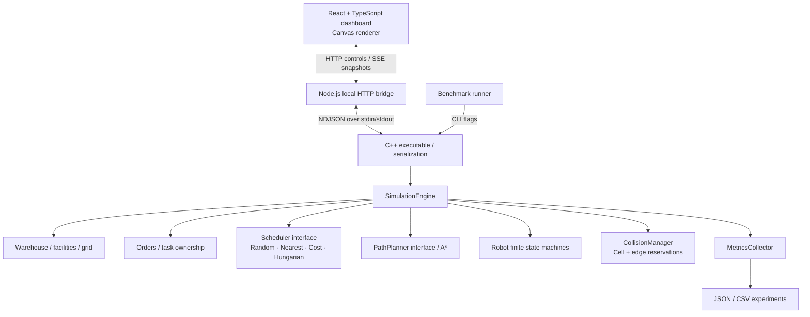
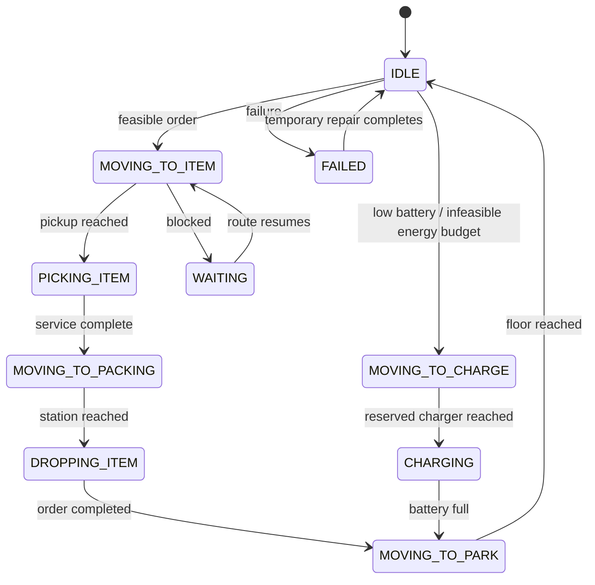

# Architecture

Pathfinder is a local, deterministic C++20 simulation with an optional browser interface. The CLI and dashboard execute the same engine. The browser never simulates robots or invents metrics.

## Ownership and responsibility

| Component | Responsibility |
| --- | --- |
| `Warehouse` | Immutable ASCII topology, indexed facilities, shelf pickup access, procedural maps, BFS distance fields |
| `Robot` | Identity, position, destination, remaining route, task, battery, state, failure and time counters |
| `Order` / `Task` | Persistent order record versus a robot's current pickup/delivery work |
| `Scheduler` | Select feasible robot/order pairings; replaceable through one interface |
| `PathPlanner` / `AStarPlanner` | Find a route and return cost, expanded-node count, and measured computation time |
| `CollisionManager` | Cell/edge reservation timeline, simultaneous movement arbitration, four-tick forecasts |
| `MetricsCollector` | Completion samples, event counters, aggregate robot time and normalized metrics |
| `SimulationEngine` | Sole owner of mutable domain state; controls tick ordering and failure/battery behavior |
| `server/main.cpp` | CLI argument validation, bounded interactive commands, benchmark clock |
| `server/serialization.cpp` | JSON snapshots and CSV export, independent from simulation behavior |
| `server/index.mjs` | Local HTTP/SSE transport, subprocess lifetime, pause/speed controls, static frontend |

The engine owns its scheduler with `std::unique_ptr`. Domain records use value semantics and stable integer IDs. Getters expose const views, preventing the frontend or serializers from mutating domain state. The simulation is intentionally single-threaded: synchronous updates are easy to reproduce and reason about.

## One tick

1. Increment simulation time and generate capped Poisson order arrivals.
2. Decay recent traffic density; the cumulative visit heatmap remains intact.
3. Process temporary/permanent failures, service actions, charging, battery return decisions and parking.
4. At the scheduling interval, select a priority-sorted pending batch and assign feasible robots.
5. Plan routes when needed; propose at most one cell of movement per robot.
6. Resolve competing destinations and reverse-edge swaps, propagate stopped leaders to followers, and reserve the accepted move set before committing it.
7. Apply accepted moves simultaneously, record energy/distance/traffic, and transition arrivals to service states.
8. Replan persistent conflicts, try passing pockets, move idle blockers, and refresh the four-tick reservation forecast.
9. Collect robot-state time samples.

No wall clock enters these decisions. By default, one tick is one simulated second and one grid step is one meter. Changing `tick_seconds` changes modeled movement speed (one cell per tick) as well as the conversion from ticks to seconds. Action energy is per service tick; charging rate and order arrival rate are per simulated second.

## State machines

`WAITING` retains a resume state and applies to all movement states. Any operational state can fail. A failed robot remains a physical obstacle, releases its unfinished order and charger claim, and drops obsolete reservations. Temporary failures recover after a configured duration; permanent failures never move again. Reassigned work restarts at pickup, reflecting replaceable inventory rather than a physical item-transfer model.

Each station occupies one grid cell and therefore has one physical service slot. Charger ownership additionally reserves admission before a robot starts travelling there. Fully charged robots leave for floor cells so they do not monopolize chargers.

## Reproducibility

Workload, spawn positions, scheduler choices, and failures use separate seeded PRNG streams. Scheduler choices cannot consume order-generation randomness. Comparisons must use the same layout, seed, arrival rate, initial backlog, horizon, battery and failure configuration. Changing a procedural map's fleet size also changes the map; the checked-in scaling experiment instead uses the same `large.map` for every fleet size.

Reproducibility is guaranteed for an unchanged build/configuration. C++ standard-library distributions and shuffle implementations may differ across toolchains. A* wall-clock timings and benchmark wall time are intentionally nondeterministic and must be excluded from state equality checks. With failures enabled, different trajectories can change when a robot is eligible for another failure draw; failure event sequences are therefore not a common-random-events experiment across policies.

## Transport and time control

The bridge keeps one child process and serializes NDJSON commands. The child emits one state response per command. The HTTP server binds to `127.0.0.1:8080`. The production frontend is served by that same process; Vite development uses a proxy to it.

The bridge requests ticks at 1, 5, 10 or 50 simulated ticks per real second. If computation cannot keep up, it slows down without skipping simulation ticks. Pause stops requests; step submits one tick and remains paused. Restart constructs a replacement engine before discarding the current one, so invalid configuration preserves the running state. The frontend uses animation frames for rendering independently of simulation ticks. SSE applies a bounded output buffer per client. Snapshots contain the whole fleet and grid, four ticks of reservations, up to 100 order records, and full aggregate metrics.

## Scaling and limits

Paths use contiguous vectors plus a cursor rather than removing the first cell on every movement. Cached distance fields avoid repeating identical static shortest-path queries. Shelf-to-packing/charger estimates are computed once. Hungarian assignment is bounded by the number of orders in a batch (48 by default, at most 64 in the scheduler), while all available robots remain candidates.

Dense traffic is harder than raw fleet count. Docking, blocked aisles, parking scans, dynamic replanning and distance-field memory are practical limits. The implementation guarantees collision safety under the modeled motion rules; it does not guarantee deadlock freedom, global route optimality, starvation freedom, or completion when failed robots disconnect the map. Benchmark queues and throughput expose these limits instead of concealing unfinished work.

## Extension points

- Implement `PathPlanner` to compare spatial planners.
- Implement `Scheduler` to compare assignment policies.
- Add a joint route-planning layer above `CollisionManager` for CBS; preserve the atomic movement guard as a safety assertion.
- Add multi-item tasks by extending service transitions and item ownership.
- Add variable robot dynamics only after defining collision occupancy during multi-tick moves.
- Keep network hosting separate from engine semantics; this local bridge is not a multi-user deployment service.
