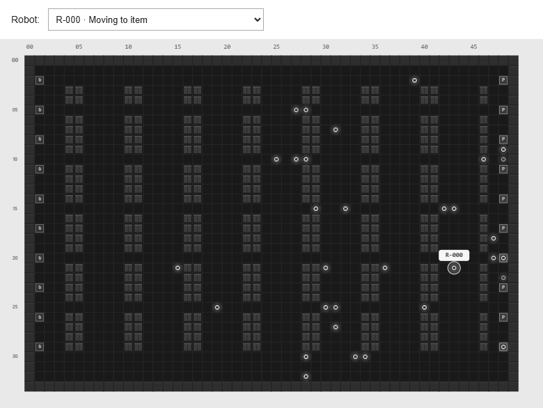

# Demo recording



The README uses `demo.gif`: an eight-second looping recording of the real C++ simulation, cropped to the warehouse and robot dropdown. It has 80 frames, includes robot selection changes, and contains no heatmap, reservation, or planned-path overlays. A GIF is a recording; its dropdown is not interactive.

## Recreate it

With dependencies installed and the built simulator running through `npm start`:

```sh
node scripts/capture-demo.mjs
```

The capture script uses installed Chrome (or Playwright Chromium with `CI=1`), resets to the medium layout with 32 robots and seed 42, and advances the native engine one tick per frame. Presentation-only cropping does not alter robot positions. `recording.json` records frame count, tick range and settings.

`screenshot.png` is retained as a full-dashboard reference from browser testing; the repository front page displays the GIF instead.
